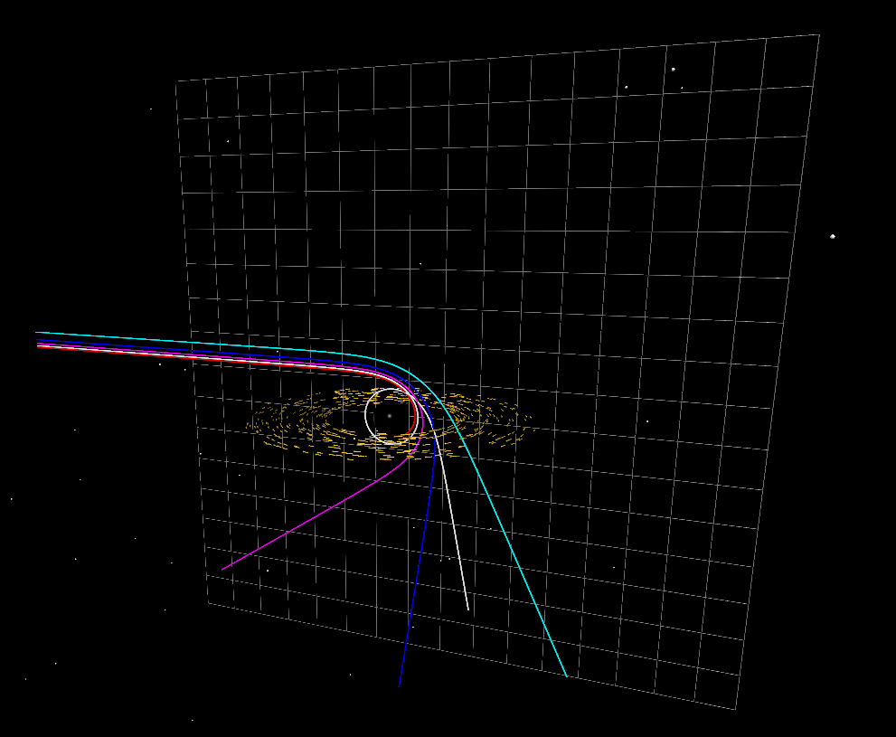

# Simulação da Geodésica de Fótons na Métrica de Schwarzschild
                                
## Modelo Físico

Na Relatividade Geral de Einstein (RG), as equações de campo descrevem como a geometria do espaço-tempo é curvada pela presença de massa e energia. Neste contexto, a única solução esfericamente simétrica para o vácuo ao redor de um corpo estático é a **Métrica de Schwarzschild**, cuja unicidade é garantida pelo Teorema de Birkhoff.

A geometria do problema é descrita pelo seguinte elemento de linha:

$$ds^2 = -\left(1 - \frac{r_s}{r}\right)c^2 dt^2 + \left(1 - \frac{r_s}{r}\right)^{-1} dr^2 + r^2 d\Omega^2$$+

Para o disco de acreção, usamos a Mecânica Newtoniana, isso evita a necessidade de correções relativísticas para matéria em órbita estável, mantendo o foco visual na distorção da luz:

$$\vec{a}_{materia} = - \frac{GM}{r^3} \vec{r}$$

##  A Simulação

### Visualização da trajetória dos fótons 

Nesta simulação, calculamos as trajetórias de fótons (luz) ao passarem nas proximidades de um buraco negro. Como mostrado na Figura 1, observamos fenômenos como a deflexão da luz e a captura orbital.

<p align="center">
  
  <br>
  <em>Figura 1: Trajetórias de fótons (coloridos) sendo defletidos ou capturados pelo buraco negro.</em>
</p>

Para realizar essa simulação, não podemos utilizar a gravitação Newtoniana clássica, visto que fótons não possuem massa de repouso ($m=0$). Em vez disso, utilizamos o formalismo do **Potencial Efetivo** ($V_{eff}$) derivado da métrica de Schwarzschild:

$$V_{eff}(r) = \frac{L^2}{r^2} \left(1 - \frac{r_s}{r}\right)$$

A partir desse potencial, obtemos a equação de movimento radial. O termo de correção relativística gera uma "força atrativa" extra (proporcional a $r^{-5}$), permitindo a existência de órbitas instáveis e a captura da luz:

$$\vec{a}_{eff} \propto - \frac{3GM L^2}{r^5} \vec{r}$$


### Visualização do Disco de Acreção

O disco foi geraddo utilizando uma distribuição gaussiana, posicionando as partículas com uma variação aleatória no eixo vertical ($y$), isso cria um volume visual com efeito de núvem de poeira.
Além disso, foi utilizado propriedades de renderização (`opacity` e `emissive`) do VPython para simular o brilho difuso do gás superaquecido, permitindo ver as trajetórias dos fótons através do disco. 

##  Como Rodar a Simulação

### Pré-requisitos
Para executar a simulação, você precisa do **Python 3.10+** instalado.

### Instalação
1. Clone este repositório:

```
        git clone [https://github.com/arthurcesar-fisica/Geodesicas-em-Schwarzschild.git](https://github.com/arthurcesar-fisica/Geodesicas-em-Schwarzschild.git)
```

2. Entre na pasta do projeto:

```
  cd Geodesicas-em-Schwarzschild/Schwarzschild_simulacao
```

4.Instale as dependências:

```
  pip install numpy vpython scipy
```

5. Execução: Basta rodar o arquivo principal no terminal:

```
   python main.py
```

A simulação abrirá automaticamente no seu navegador padrão ou em uma janela dedicada.

## Estrutura do Código
O projeto foi organizado de forma modular para separar a física da visualização:

  
  `main.py`: Loop principal da simulação e configuração inicial dos fótons.

  
`physics.py`: Contém as "Leis da Física".
    
  * `aceleracao_luz()`: Calcula a força geodésica na métrica de Schwarzschild.
  
  * `aceleracao_materia()`: Calcula a gravidade newtoniana.
    
  * `hamiltoniana_sistema()`: Implementação original via mecânica hamiltoniana (mantida para referência).

  
  `config.py`: Arquivo de configuração com constantes físicas ($M$, r_s, c$) e parâmetros ajustáveis.

  
  `visualizacao.py`: Gerencia a cena do VPython, renderização do Buraco Negro e trilhas dos fótons.


## Decisões Técnicas e Métodos Numéricos

###  De RK4 para Velocity Verlet
Inicialmente, o projeto foi realizado utilizando o integrador **Runge-Kutta de 4ª Ordem (RK4)**, baseado nas equações de Hamilton. Embora o RK4 seja excelente para precisão de curto prazo, notamos que ele não conserva a energia do sistema em longas simulações orbitais, fazendo com que o disco de acreção espiralasse para fora ou para dentro artificialmente (drift de energia).
Para corrigir isso e garantir a estabilidade das órbitas do disco e a precisão da captura de fótons, migramos para o algoritmo **Velocity Verlet**.
Vantagens do Velocity Verlet neste projeto:
1.   Preserva o volume no espaço de fase, garantindo conservação de energia a longo prazo para o disco de acreção.
2.   Requer apenas uma avaliação de força por passo (contra 4 do RK4), permitindo simular centenas de partículas simultaneamente com FPS alto.
3.   Facilita a aplicação de forças diferentes para objetos diferentes (Newton para o disco, RG para a luz) no mesmo loop.

## Ferramentas Utilizadas

```Python``` : Linguagem base.

```NumPy``` : Álgebra linear e operações vetoriais otimizadas.

```VPython``` : Renderização 3D em tempo real baseada em WebGL.

```Git``` : Controle de versão.

## Seção de Resultados

A trajetória de cada um dos fótons é alterada nas proximidades do buraco negro. Um caso especial, é o caminho realizado pelo fóton (branco) que executa uma volta completa antes de ser emitido.

Como previsto pela Relatividade Geral, o fóton não é imediatamente capturado nem escapa diretamente, ele entra temporariamente na Esfera de Fótons ($r = 1.5r_s$), executando órbitas instáveis ao redor do buraco negro antes de ser dispersado. Isso demonstra a estabilidade numérica do integrador Velocity Verlet em regiões de alta gravidade.


## Próximos Passos 

Este projeto está em desenvolvimento contínuo. As próximas atualizações visam expandir tanto a precisão física quanto a qualidade visual:

- [X] **Disco de Acreção:** Adicionar elementos visuais para simular matéria orbitando o buraco negro, permitindo visualizar o efeito de lente gravitacional sobre o disco.
- [ ] **Métrica de Kerr:** Expandir a simulação para buracos negros em rotação (solução de Kerr), onde a simetria esférica é quebrada.
- [ ] **Análise de Energia:** Implementar gráficos em tempo real mostrando a conservação da energia e do momento angular para validar a precisão do integrador numérico.
- [ ] **Interface Interativa:** Permitir que o usuário altere o parâmetro de impacto ($b$) e a posição inicial dos fótons durante a execução.

**Autor**: Arthur Cesar


  


